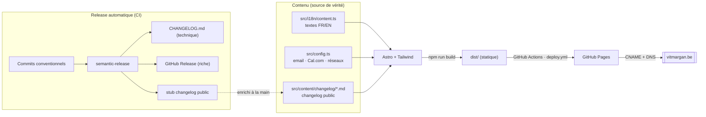

# vitmargan.be — Site vitrine

Site vitrine one-page de **Vincent Margan**, freelance IT ([Vitmargan SRL](https://vitmargan.be)).
Construit avec **Astro** + **Tailwind CSS v4**, bilingue **FR / EN**, thème **nuit étoilée** (bleu).

## 🏗️ Architecture & flux



## 🧞 Commandes

| Commande            | Action                                          |
| :------------------ | :---------------------------------------------- |
| `npm install`       | Installe les dépendances                        |
| `npm run dev`       | Serveur local sur `localhost:4321`              |
| `npm run build`     | Build de production dans `./dist/`              |
| `npm run preview`   | Prévisualise le build localement                |
| `npm run release:dry` | Simule une release (sans rien publier)        |

## 📁 Structure

```text
src/
├── config.ts               # Config globale (email, Cal.com, réseaux)
├── content.config.ts       # Schéma de la collection "changelog"
├── i18n/content.ts         # 👉 TOUT le contenu FR/EN (source de vérité)
├── layouts/Base.astro      # <head>, SEO/OG, polices, scripts globaux
├── components/             # Header, Hero, Services, Stack, Missions,
│                           #   Projects, About, Contact, Footer, ChangelogView
├── content/changelog/*.md  # Entrées du changelog public (bilingues)
├── styles/global.css       # Design system (tokens, textures, animations)
└── pages/
    ├── index.astro         # FR  →  /
    ├── changelog.astro     # FR  →  /changelog
    └── en/                 # EN  →  /en, /en/changelog
```

## ✏️ Éditer le contenu

- **Textes, missions, projets** : `src/i18n/content.ts` (arbres `fr` et `en` à garder synchro). Les `TODO` sont des placeholders à confirmer.
- **Email / réseaux / réservation** : `src/config.ts`.
- **Couleurs / polices / textures** : bloc `@theme` dans `src/styles/global.css`.
- **Changelog public** : un fichier par version dans `src/content/changelog/`.

## 📅 Réservation (Cal.com)

Le site est câblé pour **Cal.com** (open-source, auto-hébergeable sur Coolify).
Dans `src/config.ts`, renseigner `calLink` (ex. `vincent-margan/30min`) et
éventuellement `calOrigin`. Tant que `calLink` est vide, les boutons basculent
proprement sur un `mailto:`.

## 📊 Analytics (Umami)

Privacy-first, **sans cookies** (pas de bandeau RGPD). Renseigner `umamiSrc` +
`umamiWebsiteId` dans `src/config.ts` — le script ne se charge que si les deux
sont remplis. Instance **Umami auto-hébergée sur Coolify**.

## 🔖 Versioning & changelog

Automatisé via **semantic-release** + **Conventional Commits**. Voir
[`docs/RELEASING.md`](docs/RELEASING.md). Politique : `0.0.1` en baseline, `1.0.0`
réservé à la mise en production.

## 🚀 Déploiement

Site **100% statique**, déployé **automatiquement sur [GitHub Pages](https://vitmargan.be)**
(via GitHub Actions) à chaque push sur `main`.

**Pipeline** : PR → `ci.yml` (build) · `main` → `release.yml` (version + changelog +
release GitHub) **et** `deploy.yml` (build + Pages).

_Un `Dockerfile` (nginx) est également fourni comme alternative d'hébergement (ex. Coolify)._
